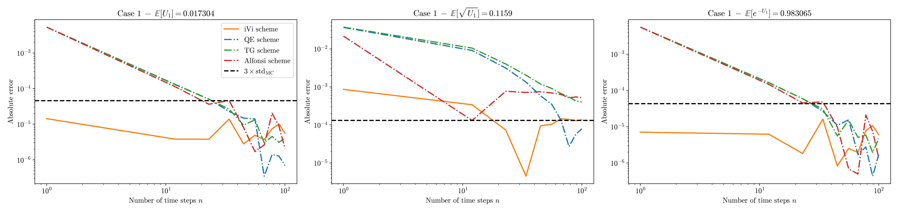
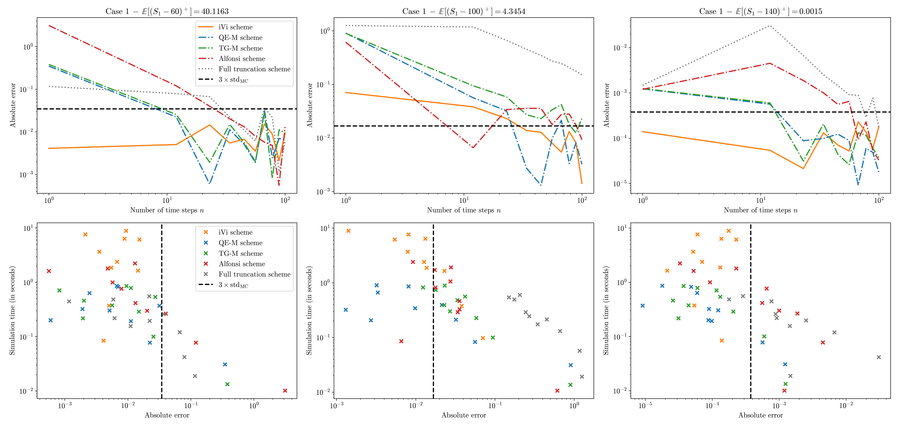
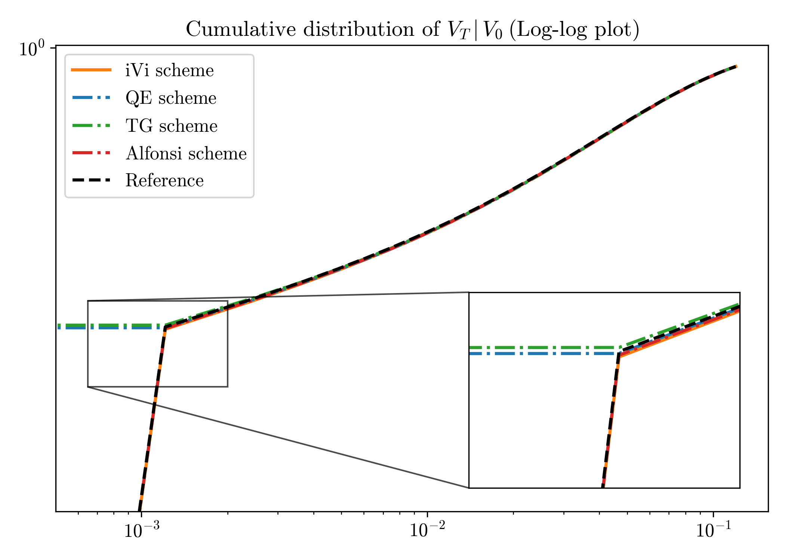

### Simulation of square-root processes made simple: applications to the Heston model

This repository reproduces the results of [E. Abi Jaber (2025)](https://arxiv.org/pdf/2412.11264), [L. Andersen (2006)](https://www.ressources-actuarielles.net/EXT/ISFA/1226.nsf/0/1826b88b152e65a7c12574b000347c74/$FILE/LeifAndersenHeston.pdf) and [A. Alfonsi (2008)](https://hal.science/hal-00143723v5/document).

We implement: 

### Examples of illustrations 

### Disclaimer 
Source code is available upon request. Please contact me directly. 